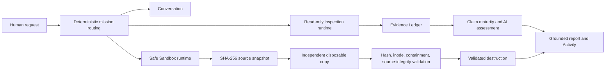

# Architecture

## Product boundary

FDE Agent v0.1.0 is a macOS SwiftUI application and a Swift Package. The public path accepts conversation input, classifies the mission, binds it to explicit workspace identities, performs bounded inspection, records evidence, composes an assessment, and optionally runs the Safe Sandbox lifecycle. The original Legacy root is never a writable target.

## Main components

| Area | Responsibility |
| --- | --- |
| `App` | Live dependency composition, persistence selection, model configuration, and application startup. |
| `Core/Agent` | Conversation, session, routing, workspace context, activity, and response composition. |
| `Core/Runtime` | Mission state, read-only inspection loop, evidence ledger, event stream, and completion contracts. |
| `Core/Assessment` | Agent capability profiles, Legacy architecture signals, claim-backed assessment, blockers, and validation plans. |
| `Core/Sandbox` | Exclusions, snapshots, manifests, copy validation, containment, source monitoring, and destruction. |
| `Core/Persistence` | In-memory and local SQLite event/state persistence. |
| `Core/AI` | Deterministic fallback and optional external model-provider boundaries. |
| `UI` | SwiftUI presentation of workspaces, conversation, evidence-driven activity, and results. |

## Workspace isolation

A `Workspace` can hold a Legacy root and a distinct Agent root. Read-only missions resolve an explicit target: Legacy, Agent, or comparison. Safe Sandbox creation accepts only the approved Legacy root and rejects configured Agent roots. Sandbox storage must be external to the Legacy tree.

## Public execution composition

`AppEnvironment.live()` composes `PublicReleaseToolExecutor` for generic model-emitted tool calls. That executor accepts only API calls named in `ReadOnlyInspectionPolicy.allowedTools` and rejects every other tool type or command. Prompt/context tool discovery uses the same ordered read-only list.

The public mission router exposes three engineering outcomes: read-only Legacy inspection, AI Agent integration assessment over the same read-only evidence runtime, and `SAFE_SANDBOX_ACCEPTANCE`. Safe Sandbox acceptance is a dedicated route: `AgentRuntimeCoordinator` calls `RuntimeKernel.runSafeSandboxAcceptance`, which uses `SandboxLifecycleService` directly rather than passing Sandbox work through `PublicReleaseToolExecutor`. It performs manifest-backed Swift filesystem operations and no shell commands. `SandboxRuntimePolicy.phase2D0Allowlist` remains empty, so the dedicated route cannot perform Candidate Patch, generated-test, or product-file mutation operations.

The source tree retains earlier internal executor implementations for deterministic compatibility tests. They are not the v0.1.0 live product composition. Their presence is documented in [known limitations](known-limitations.md) and should be removed or isolated more strongly in a future major cleanup.

## Persistence and network

Runtime state can be stored in a local SQLite database under the user's Application Support directory. The database is runtime data and is never part of the repository. The deterministic local model needs no network. Optional external model providers use public vendor endpoints only when the user supplies configuration; CI sets the local provider and supplies no credentials.
